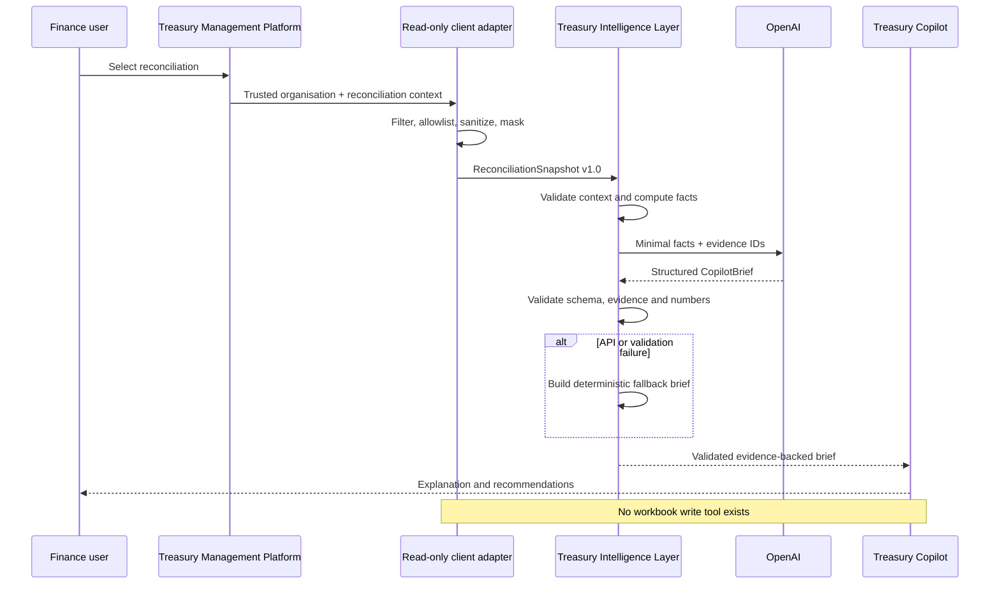

# Architecture and Data Mapping

## Architectural distinction

The **Treasury Management Platform** remains the operational system of record. **Treasury Copilot** is an independent intelligence layer. No AI logic is embedded in the frozen VBA baseline.

## Confirmed production mappings

The supplied data dictionary was derived from the authoritative `.xlsb` structure and cross-checked against exported VBA references.

### Header allowlist

`OrganisationID`, `ReconciliationID`, `BankAccountID`, `BankName`, masked `AccountNumber`, `Currency`, `StatementStartDate`, `StatementEndDate`, `OpeningStatementBalance`, `ClosingStatementBalance`, `SystemOpeningBalance`, `SystemClosingBalance`, and `ReconciliationStatus`.

### Reconciliation-line allowlist

`OrganisationID`, `ReconciliationLineID`, `ReconciliationID`, `LineSource`, `TransactionDate`, sanitized `Description`, truncated `ReferenceNo`, `DebitAmount`, `CreditAmount`, `Currency`, `MatchStatus`, and `MatchType`.

### Adjustment allowlist

`OrganisationID`, `AdjustmentID`, `ReconciliationID`, `AdjustmentDate`, `AdjustmentType`, `AdjustmentAmount`, `AdjustmentStatus`, and sanitized `Description`.

### Explicit exclusions

`RawImportedText`, all user-identifying workflow fields, `PayeePayer`, `SourceFileName`, review/free-form notes, passwords/hashes, and full account numbers.

## Control enforcement

1. Organisation ID comes from the trusted client/session, never the user prompt.
2. Every collection is filtered before snapshot creation.
3. The selected reconciliation ID is applied together with organisation scope.
4. The server revalidates every received row.
5. No write-capable model tool is registered.
6. Output citations must exist in the snapshot evidence registry.
7. Currency amounts are validated against deterministic facts.
8. Failures return a safe deterministic brief and preserve state.

## Production integration checkpoint

Before enabling live workbook extraction, run `validateTableHeaders` against an owner-opened read-only export and confirm every required column. Any mapping drift fails closed. The baseline workbook itself must not be changed or converted.

